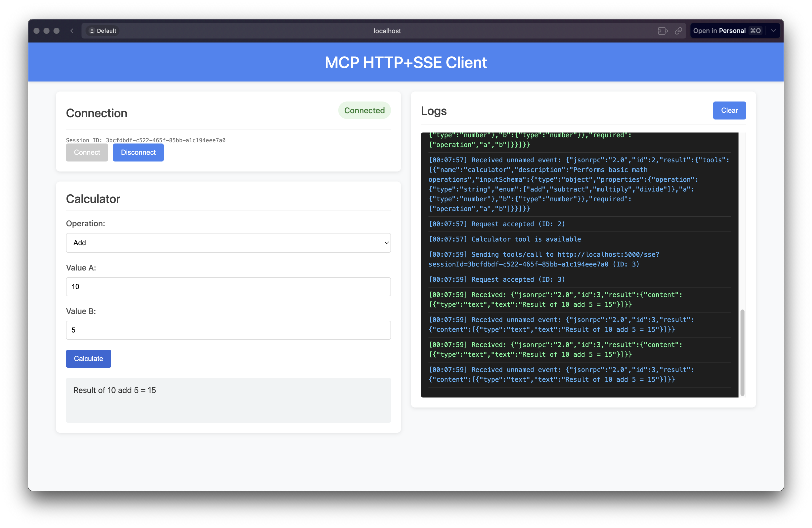
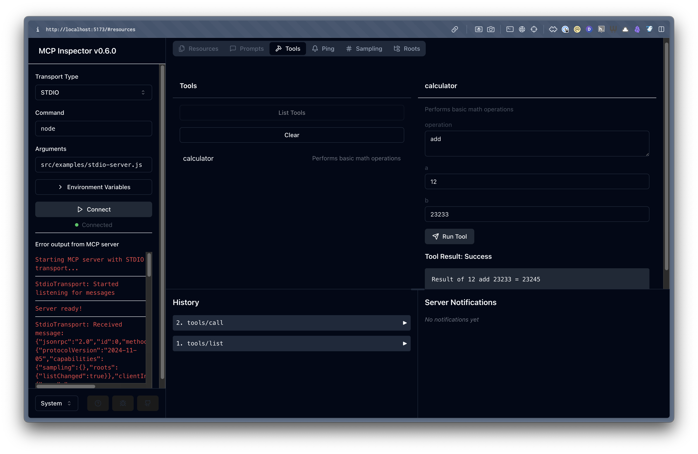

# Model Context Protocol (MCP) Implementation

This project implements the [Model Context Protocol (MCP)](https://spec.modelcontextprotocol.io/) for building AI tools. It provides a modular framework that can be used to create MCP-compatible servers and clients.

---

## 🔍 What is Model Context Protocol (MCP)?

The Model Context Protocol (MCP) is an open protocol that enables AI assistants to interact with external tools and data sources.

<details>
<summary><b>Key Features</b></summary>

- List available tools and their capabilities
- Call tools with parameters
- Handle errors in a consistent way
- Process tool results in a standardized format
</details>

📚 For a detailed overview, see [MCP Notes](notes/mcp.md).

---

## ✨ Features

| Category | Features |
|----------|----------|
| **Core** | ✅ JSON-RPC 2.0 message handling<br>✅ Protocol initialization<br>✅ Capability negotiation |
| **Tools** | ✅ Tool registration with JSON Schema<br>✅ Tool invocation and validation<br>✅ Standardized error handling |
| **Transport** | ✅ STDIO support<br>✅ HTTP+SSE Support |
| **Testing** | ✅ Test clients |

---

## 📁 Project Structure

```
src/
├── core/           # Core MCP server implementation
├── transports/     # Transport layer implementations (stdio, HTTP+SSE)
├── tools/          # Tool definitions and handlers
├── examples/       # Example servers and clients
│   └── public/     # Static files for HTTP server
└── index.js        # Main entry point for the library
```

---

## 🚀 Getting Started

### Prerequisites

- Node.js 20.x or later
- npm or pnpm

### Installation

```bash
# Clone the repository
git clone https://github.com/AshikNesin/learn-mcp-by-building
cd learn-mcp-by-building

# Install dependencies
npm install
# or
pnpm install
```

---

## 🏃‍♂️ Running the Examples

### STDIO Server and Client

Run the STDIO server:

```bash
npm run server:stdio
# or
node src/examples/stdio-server.js
```

Test with the STDIO client:

```bash
npm run client:stdio
# or
node src/examples/stdio-client.js
```

Run both together to see a complete test:

```bash
npm run test:stdio
# or
node src/examples/stdio-client.js | node src/examples/stdio-server.js
```

### HTTP+SSE Server and Client

Run the HTTP+SSE server:

```bash
npm run server:sse
# or
node src/examples/http-sse-server.js --port 5000
```

Available options:
- `--port`: Port to listen on (default: 5000)
- `--host`: Host to bind to (default: localhost)
- `--path`: Endpoint path (default: /sse)
- `--cors`: Enable CORS (default: true)
- `--serve-static`: Serve static files from src/examples/public (default: true)

Test with the HTTP+SSE client:

```bash
npm run client:sse
# or
node src/examples/http-sse-client.js --server http://localhost:5000/sse
```

Once running, you can also access the web-based client interface in your browser at http://localhost:5000:



The interface provides a user-friendly way to interact with the MCP server, with a side-by-side layout showing the calculator controls and real-time logs.

### 🔍 Using the MCP Inspector

You can use the official MCP Inspector to debug the server:

```bash
npm run debug
```

The MCP Inspector provides a visual interface for monitoring and debugging MCP servers:



---

## 🧮 Calculator Tool

<table>
<tr>
<td>

**Operations**
- ➕ add
- ➖ subtract
- ✖️ multiply
- ➗ divide

</td>
<td>

**Parameters**
- `operation` - Operation type
- `a` - First operand
- `b` - Second operand

</td>
<td>

**Error Handling**
- Division by zero
- Invalid operations
- Type validation
- Missing parameters

</td>
</tr>
</table>

---

## 🧑‍💻 Developing with the MCP Framework

### Creating a New Server

```javascript
import { McpServer } from '../core/index.js';
import { StdioTransport } from '../transports/index.js';
import { calculatorToolDefinition, handleCalculatorTool } from '../tools/index.js';

// Create server instance
const server = new McpServer(
  { name: 'my-server', version: '1.0.0' },
  { capabilities: { tools: { listChanged: true } } }
);

// Register tool handlers
server.setRequestHandler('tools/list', () => ({ tools: [calculatorToolDefinition] }));
server.setRequestHandler('tools/call', async (params) => {
  if (params.name === 'calculator') {
    return handleCalculatorTool(params.arguments);
  }
  throw new Error(`Tool ${params.name} not found`);
});

// Start the server
const transport = new StdioTransport();
server.connect(transport)
  .then(() => console.error('Server ready!'));
```

### Creating a New Tool

1. Create a new file in `src/tools/`:

```javascript
// src/tools/my-tool.js
export const myToolDefinition = {
  name: 'my-tool',
  description: 'Description of my tool',
  inputSchema: {
    type: 'object',
    properties: {
      // Define parameters
    },
    required: []
  }
};

export async function handleMyTool(args) {
  // Implement tool logic
  return {
    content: [
      {
        type: 'text',
        text: 'Result from my tool'
      }
    ]
  };
}
```

2. Export the tool in `src/tools/index.js`:

```javascript
export * from './my-tool.js';
```

---

## 🛠️ Protocol Features

- ✅ Capability negotiation
- ✅ Tool list change notifications
- ✅ Standardized error handling
- ✅ JSON Schema validation 
- ✅ Structured tool results
- ✅ Transport layer abstraction

---

## 📚 External Resources

- [MCP Protocol Specification](https://spec.modelcontextprotocol.io/specification/2024-11-05/)
- [JSON-RPC 2.0 Specification](https://www.jsonrpc.org/specification)
- [MCP GitHub Repository](https://github.com/modelcontextprotocol)

---

## 📝 License

[MIT](LICENSE)
